# MealMind AI - Gọi Món Ăn Thông Minh

MealMind AI là ứng dụng Android hỗ trợ gợi ý món ăn theo nguyên liệu, ngân sách, thời gian nấu và mục tiêu sức khỏe. Ứng dụng có hai vai trò chính: người dùng thường và quản trị viên. Người dùng có thể tìm món, yêu thích món, hỏi trợ lý gợi ý món ăn, gửi công thức cộng đồng và theo dõi thông báo. Admin có thể duyệt, từ chối, ẩn, khôi phục món ăn và quản lý dữ liệu hệ thống.

## Thông Tin Project

| Mục | Giá trị |
| --- | --- |
| Tên ứng dụng | MealMind AI |
| Nền tảng | Android |
| Ngôn ngữ | Java |
| Giao diện | XML Layout |
| Package | `hung.edu.mealmindai` |
| Database/Auth | Firebase Authentication, Cloud Firestore |
| Build tool | Gradle Kotlin DSL |
| UI chính | Material Components, RecyclerView |
| Load ảnh | Glide |

## Video Demo

Video quay màn hình demo hoạt động ứng dụng, có trình bày luồng user/admin, các chức năng chính và các chức năng nâng cấp:

[Xem video demo MealMind AI trên Google Drive](https://drive.google.com/file/d/11ohHSlXV4Ay9JT4QuH5JDHopjWbRYC2u/view?usp=sharing)

## Công Nghệ Sử Dụng

- Java Android
- XML Layout
- Firebase Authentication
- Cloud Firestore
- Material Components
- RecyclerView
- Glide
- Speech Recognizer / Google Voice Input
- Rule-based recommendation engine

## Chức Năng Chính

### Người dùng

- Đăng ký, đăng nhập, đăng xuất bằng Firebase Authentication.
- Cập nhật hồ sơ cá nhân: chiều cao, cân nặng, mục tiêu sức khỏe, ngân sách, thời gian nấu.
- Xem danh sách món ăn đã được admin duyệt.
- Tìm món theo nguyên liệu, hỗ trợ tiếng Việt có dấu và không dấu.
- Tìm món bằng giọng nói qua micro.
- Xem chi tiết món ăn: ảnh, mô tả, calo, chi phí, thời gian, nguyên liệu và cách làm.
- Thêm hoặc bỏ món yêu thích.
- Gửi công thức món ăn cộng đồng, trạng thái ban đầu là `pending`.
- Hỏi MealMind AI để nhận gợi ý món ăn rule-based, không gọi API AI bên ngoài.
- Xem lịch sử gợi ý AI.
- Xem thông báo món được duyệt, bị từ chối và gợi ý món hôm nay.

### Quản trị viên

- Đăng nhập theo role `admin`.
- Xem dashboard thống kê.
- Xem danh sách món chờ duyệt.
- Duyệt món: `pending` → `approved`.
- Từ chối món: `pending` → `rejected`.
- Quản lý toàn bộ món ăn theo trạng thái: approved, pending, rejected, hidden.
- Ẩn món đã duyệt: `approved` → `hidden`.
- Khôi phục món đã ẩn: `hidden` → `approved`.
- Quản lý danh mục món ăn.
- Xem thống kê tổng quan hệ thống.

## Phân Quyền User/Admin

Người dùng thông thường đăng ký tài khoản qua ứng dụng và mặc định có vai trò `user`.

Tài khoản admin không được đăng ký công khai để tránh người dùng tự cấp quyền quản trị. Admin được tạo bởi quản trị hệ thống bằng cách gán trường:

```text
role = "admin"
```

trong collection `users` trên Cloud Firestore. Khi đăng nhập, hệ thống đọc:

```text
users/{uid}.role
```

để điều hướng đến `MainActivity` hoặc `AdminDashboardActivity`.

## Firestore Collections

| Collection | Vai trò |
| --- | --- |
| `users` | Lưu hồ sơ người dùng và role |
| `recipes` | Lưu món ăn, công thức, trạng thái kiểm duyệt |
| `favorites` | Lưu món yêu thích |
| `searchHistory` | Lưu lịch sử tìm kiếm |
| `aiSuggestionHistory` | Lưu lịch sử hỏi MealMind AI |
| `notifications` | Lưu thông báo cho người dùng |
| `categories` | Lưu danh mục món ăn nếu có |

## Cấu Trúc Thư Mục Chính

```text
app/src/main/java/hung/edu/mealmindai
|-- MainActivity.java
|-- activities
|   |-- LoginActivity.java
|   |-- RegisterActivity.java
|   |-- SplashActivity.java
|   |-- RecipeDetailActivity.java
|   |-- SmartMealChatActivity.java
|   |-- NotificationActivity.java
|   |-- AiSuggestionHistoryActivity.java
|   |-- AddRecipeActivity.java
|   |-- AdminDashboardActivity.java
|   |-- PendingRecipeActivity.java
|   |-- PendingRecipeDetailActivity.java
|   |-- AdminRecipeActivity.java
|   |-- AdminRecipeDetailActivity.java
|   |-- CategoryManagerActivity.java
|   |-- StatisticsActivity.java
|-- adapters
|-- fragments
|-- models
|-- repositories
|-- utils
```

## Kết Quả Giao Diện

Ảnh được lưu trong thư mục `docs/images` để khi đưa lên GitHub vẫn hiển thị được.
Giao Diện Chính.


### 1. Đăng nhập

Màn hình đăng nhập đầu tiên của ứng dụng. Người dùng nhập email và mật khẩu để vào hệ thống.


### 2. Đăng ký tài khoản

Màn hình đăng ký tài khoản mới gồm họ tên, email, mật khẩu và xác nhận mật khẩu.


### Trang chủ

Màn hình chính sau khi đăng nhập, hiển thị lời chào, nút mở MealMind AI và danh sách món gợi ý hôm nay.

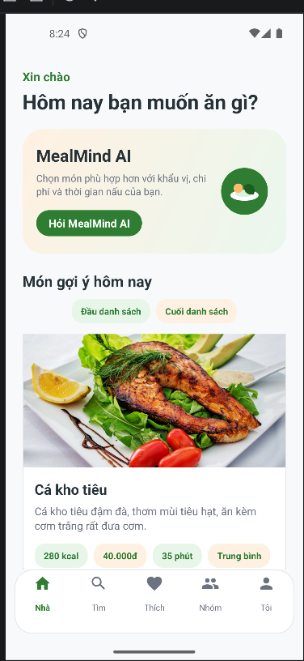

### 3. Hồ sơ ban đầu

Màn hình hồ sơ người dùng trước khi cập nhật đầy đủ thông tin sức khỏe và ngân sách.

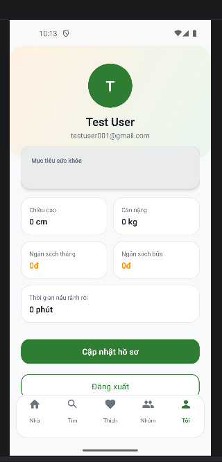

### 4. Cập nhật hồ sơ

Màn hình chỉnh sửa hồ sơ cá nhân, dùng để cá nhân hóa gợi ý món ăn.

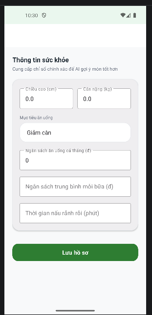

### 5. Hồ sơ sau cập nhật

Hồ sơ hiển thị mục tiêu sức khỏe, chiều cao, cân nặng, ngân sách và thời gian nấu.

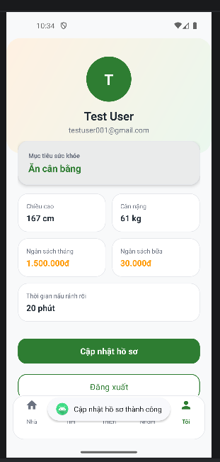

### 6. Hồ sơ có thông báo và lịch sử AI

Màn hình hồ sơ sau khi bổ sung nút Thông báo và Lịch sử AI.

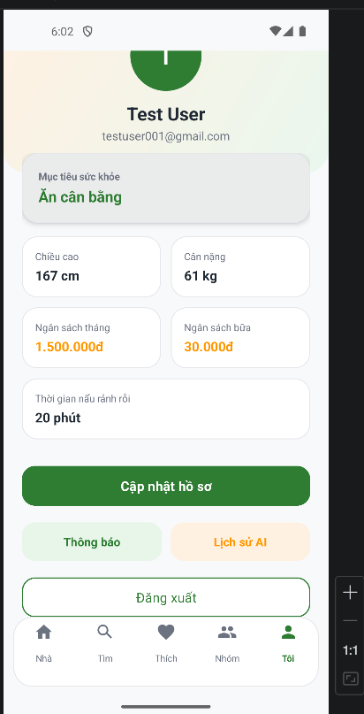

### 7. Dữ liệu user trên Firestore

Minh chứng dữ liệu hồ sơ người dùng được lưu trong Cloud Firestore.

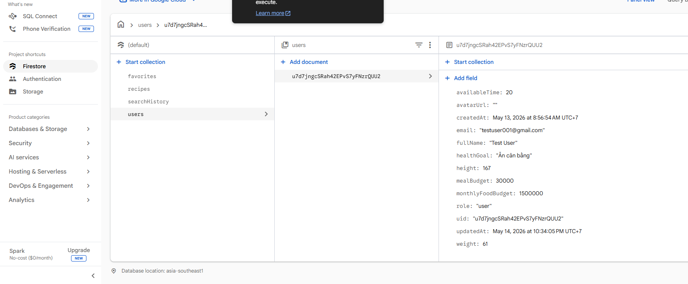

### 8. Tìm kiếm món ăn

Màn hình tìm món theo nguyên liệu. Người dùng nhập nguyên liệu để hệ thống lọc món phù hợp.

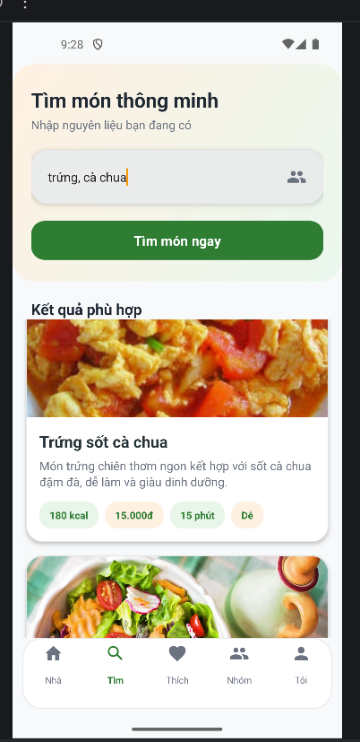

### 9. Kết quả tìm kiếm khác

Minh chứng chức năng tìm kiếm hoạt động với nhiều từ khóa nguyên liệu.

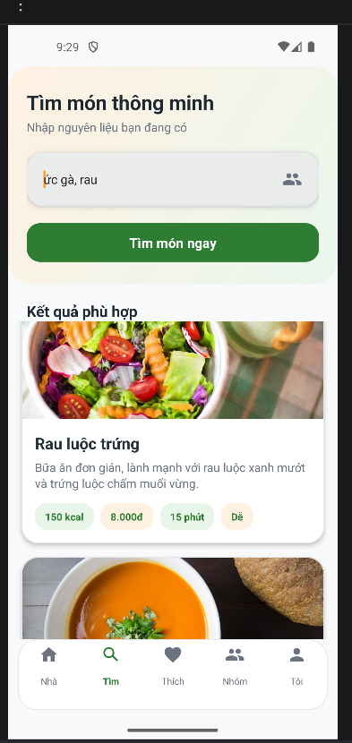

### 10. Tìm kiếm sau cập nhật hồ sơ

Kết quả tìm kiếm có xét thêm hồ sơ người dùng như ngân sách và mục tiêu ăn uống.

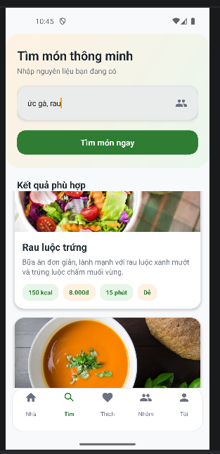

### 11. Dữ liệu tìm kiếm trên Firestore

Minh chứng lịch sử tìm kiếm được lưu trong collection `searchHistory`.

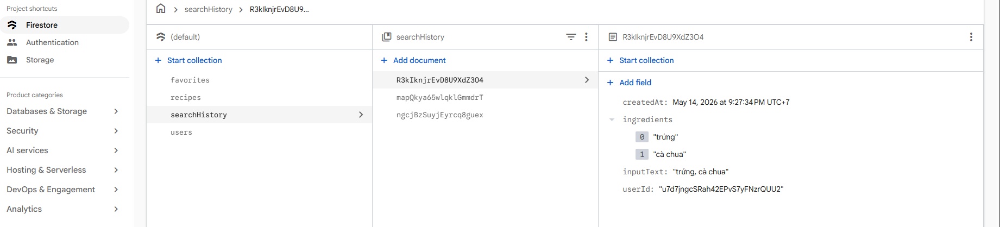

### 12. Nhập giọng nói bằng micro

Ứng dụng mở Google Speech để nhận diện giọng nói tiếng Việt.

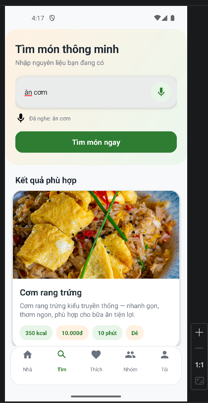

### 13. Kết quả tìm kiếm từ micro

Sau khi nhận diện giọng nói, app tự điền nguyên liệu và tìm món phù hợp.

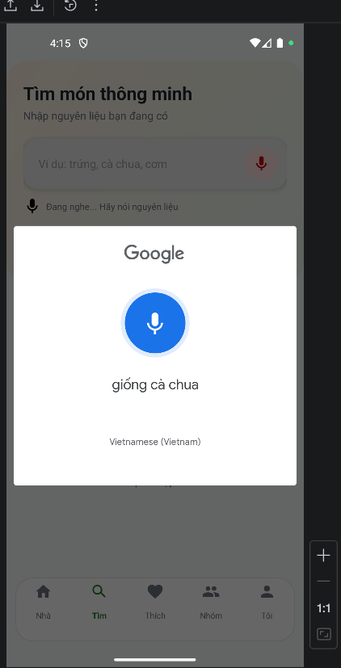

### 14. Yêu thích món ăn

Màn hình món yêu thích, nơi người dùng xem lại các món đã lưu.

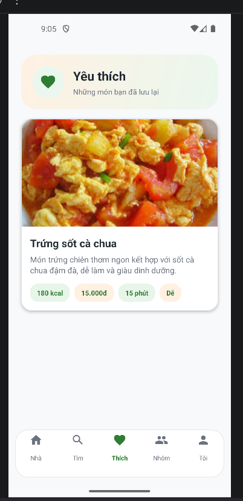

### 15. Bấm tim món ăn

Minh chứng thao tác thêm món vào danh sách yêu thích.

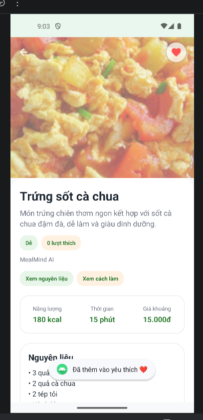

### 16. Dữ liệu yêu thích trên Firestore

Minh chứng collection `favorites` lưu món yêu thích của người dùng.

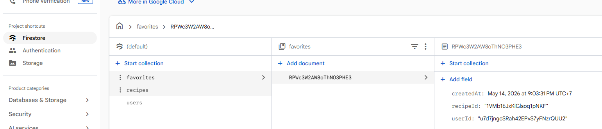

### 17. Màn hình chat MealMind AI

Màn hình trợ lý gợi ý món ăn dạng chat rule-based.

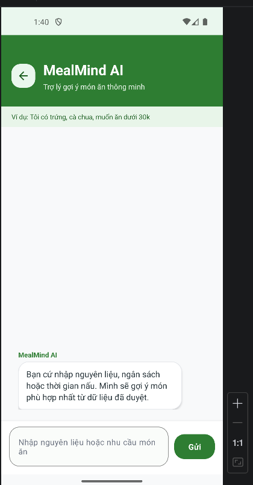

### 18. Chat AI đang hoạt động

Người dùng nhập nhu cầu món ăn, MealMind AI phân tích và trả lời dạng hội thoại.

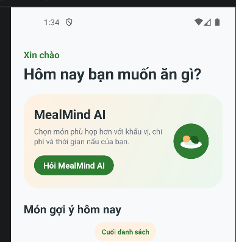

### 19. Kết quả gợi ý từ MealMind AI

AI trả về món phù hợp, lý do phù hợp và gợi ý thêm.

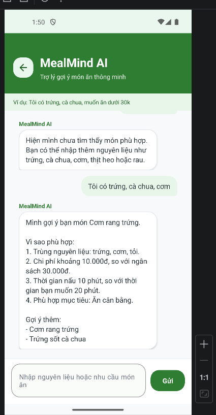

### 20. Lịch sử chat AI

Màn hình lịch sử gợi ý, xem lại câu hỏi và phản hồi của MealMind AI.

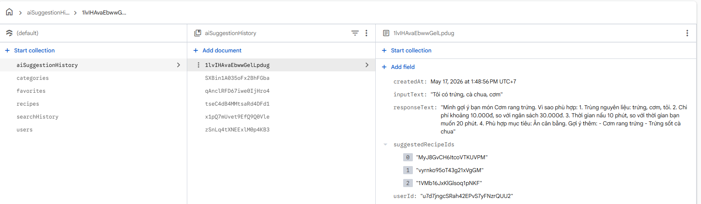

### 21. Lịch sử tìm kiếm / gợi ý

Màn hình danh sách lịch sử đã lưu để phục vụ báo cáo và kiểm tra dữ liệu.

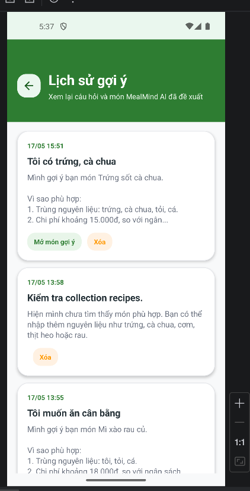

### 22. Thêm công thức món ăn

Màn hình người dùng nhập công thức mới để gửi admin duyệt.

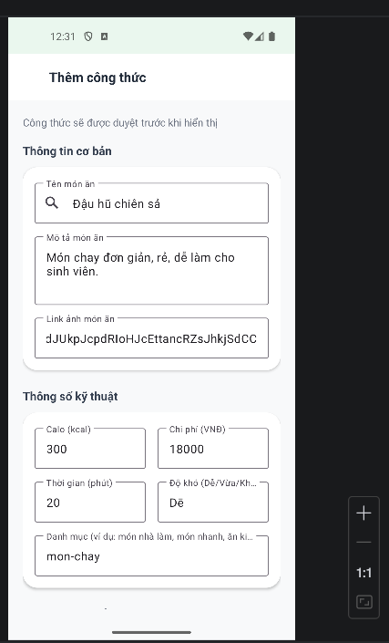

### 23. Thêm công thức có ảnh

Màn hình form thêm món với đường dẫn ảnh món ăn.

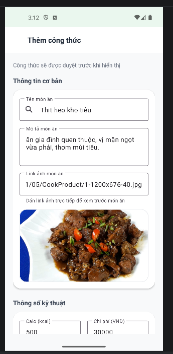

### 24. Chi tiết công thức thêm mới

Màn hình thông tin chi tiết công thức trước khi gửi duyệt.

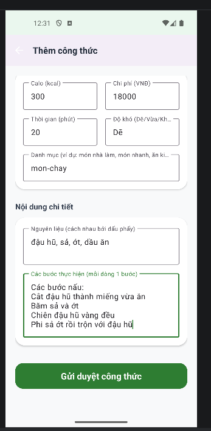

### 25. Gửi công thức chờ duyệt

Sau khi gửi, món được lưu với trạng thái `pending`.

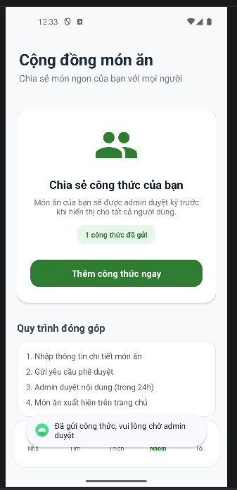

### 26. Công thức lưu trên Firebase

Minh chứng món người dùng gửi được lưu vào collection `recipes` trên Firestore.

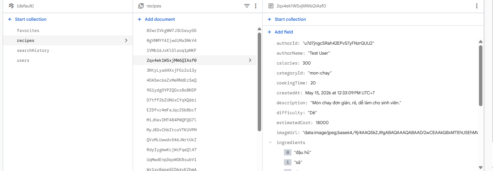

### 27. Admin Dashboard

Màn hình bảng quản lý dành cho tài khoản admin.

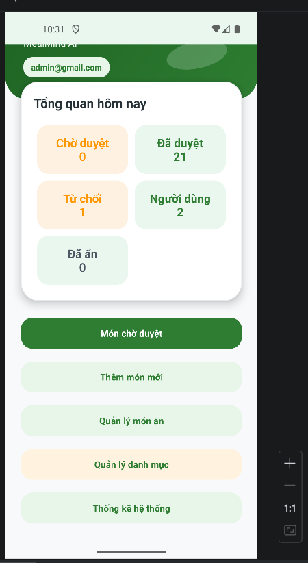

### 28. Admin Dashboard sau khi có dữ liệu duyệt

Dashboard hiển thị số lượng món chờ duyệt, đã duyệt, từ chối và người dùng.

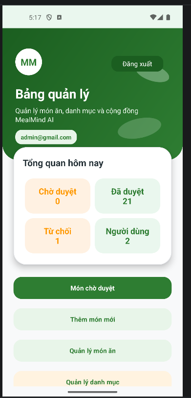

### 29. Danh sách món chờ duyệt

Admin xem các công thức người dùng gửi đang ở trạng thái `pending`.

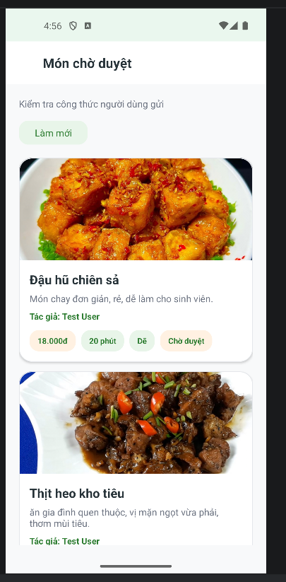

### 30. Duyệt món ăn

Admin xem chi tiết món và duyệt để món chuyển sang `approved`.

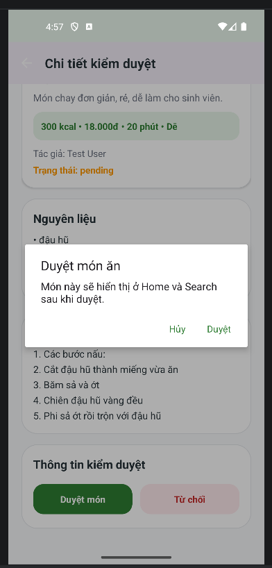

### 31. Món đã được hiển thị

Món sau khi được duyệt sẽ xuất hiện trong danh sách món cho người dùng.

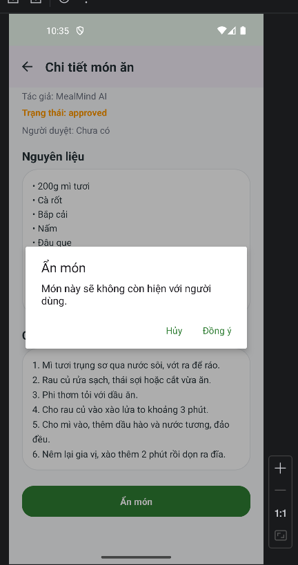

### 32. Từ chối món ăn

Món bị từ chối hiển thị trạng thái `rejected` và lý do từ chối.

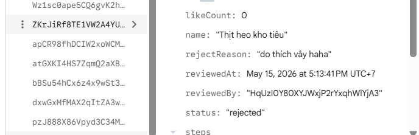

### 33. Thông báo trong app

Màn hình thông báo cho người dùng, gồm gợi ý hôm nay và trạng thái công thức.

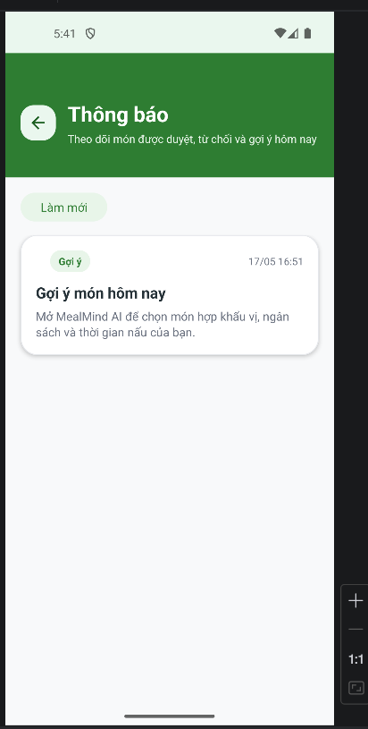

### 34. Thông báo mới

Thông báo mới được đánh dấu để người dùng dễ nhận biết.

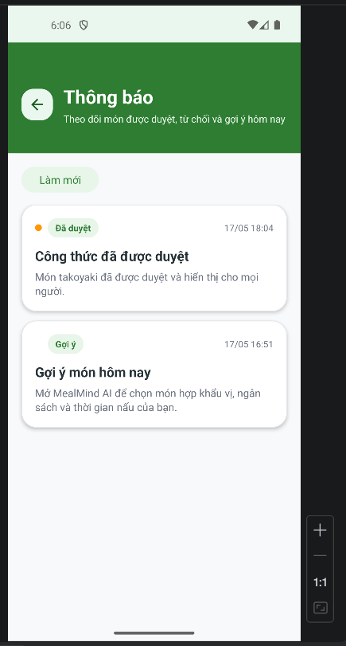

### 35. Thông báo trên Firestore

Minh chứng notification được lưu trong collection `notifications`.

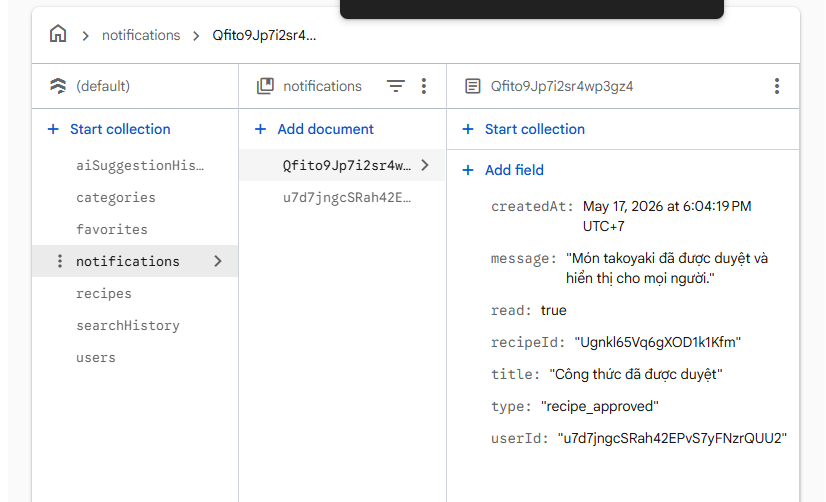

## Bổ Sung Kết Quả Phía Admin

Các màn hình dưới đây minh chứng rõ hơn luồng quản trị viên sau khi hoàn thiện các chức năng kiểm duyệt, quản lý món ăn, quản lý danh mục và thống kê hệ thống.

### 36. Màn hình chính Admin

Màn hình tổng quan dành cho quản trị viên, hiển thị nhanh các nhóm chức năng quản lý chính.

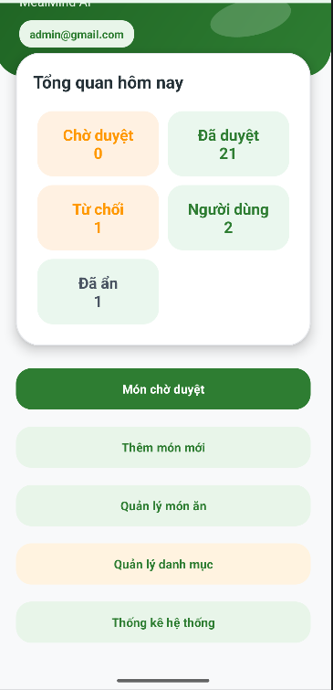

### 37. Dashboard Admin cập nhật

Dashboard hiển thị thống kê món chờ duyệt, món đã duyệt, món bị từ chối và số lượng người dùng.


### 38. Danh sách món chờ duyệt

Admin xem danh sách các công thức do người dùng gửi lên với trạng thái `pending`.

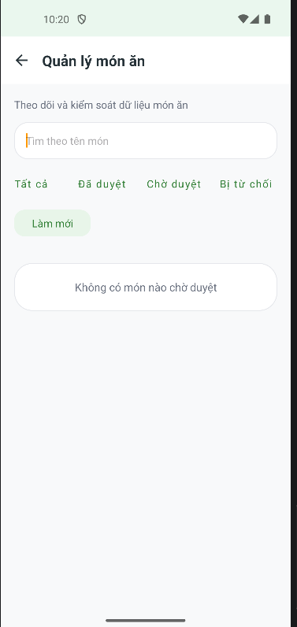

### 39. Màn hình quản lý món ăn

Admin quản lý toàn bộ món ăn theo trạng thái như đã duyệt, chờ duyệt, bị từ chối và đã ẩn.

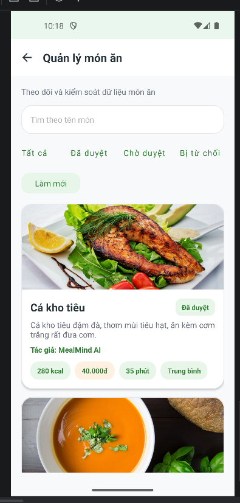

### 40. Danh sách món đã duyệt

Màn hình lọc và hiển thị các món đã được duyệt, các món này sẽ xuất hiện ở phía người dùng.

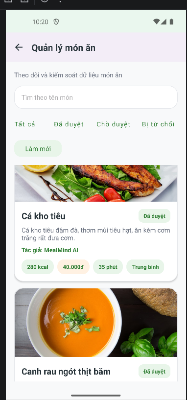

### 41. Danh sách món bị từ chối

Admin có thể xem lại các món bị từ chối để kiểm tra lý do và trạng thái kiểm duyệt.

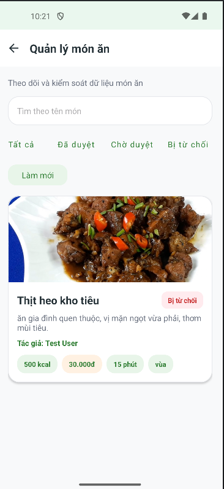

### 42. Quản lý danh mục món ăn

Màn hình quản lý danh mục, hỗ trợ admin kiểm soát nhóm món ăn trong hệ thống.

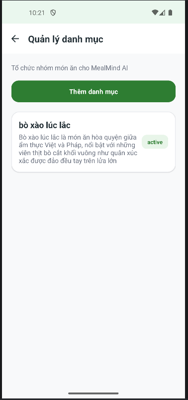

### 43. Thống kê hệ thống

Màn hình thống kê tổng quan giúp admin theo dõi số lượng user, recipes, favorites và lịch sử tìm kiếm.

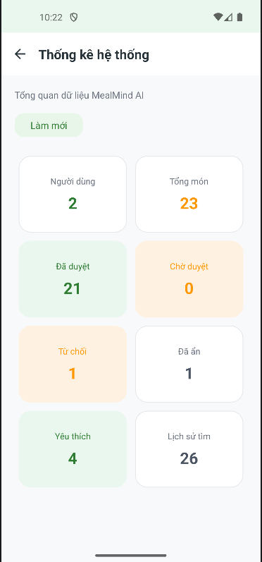

### 44. Admin thêm công thức

Admin có thể thêm món ăn mới trực tiếp vào hệ thống để phục vụ dữ liệu demo và kiểm duyệt nội bộ.

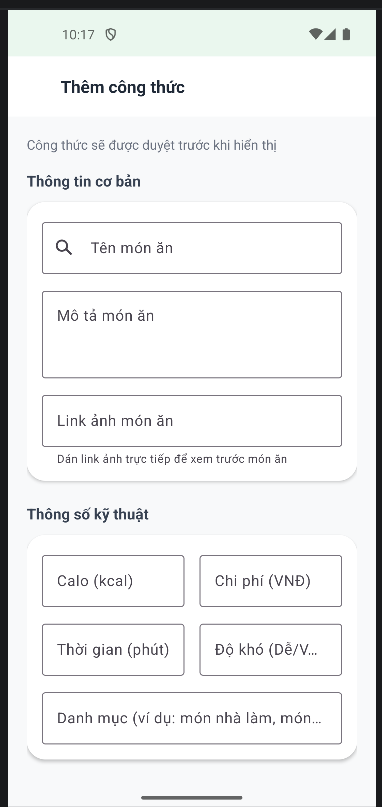

## Kết Quả Các Chức Năng Nâng Cấp

Các màn hình dưới đây là kết quả bổ sung sau khi nâng cấp ứng dụng. Các chức năng này được triển khai trên nền code hiện có, không dùng API AI bên ngoài và không thay đổi cấu trúc project.

### 45. Tủ lạnh của tôi

Người dùng lưu danh sách nguyên liệu đang có để dùng lại khi tìm món, giúp giảm thao tác nhập liệu và tận dụng nguyên liệu sẵn có.

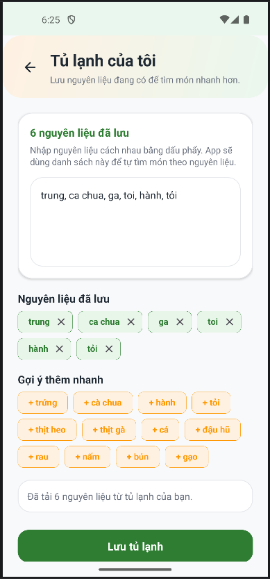

### 46. Card món ăn có điểm sao

Danh sách món hiển thị điểm đánh giá trung bình ngay trên card, giúp người dùng nhận biết món được đánh giá tốt mà không cần mở chi tiết.

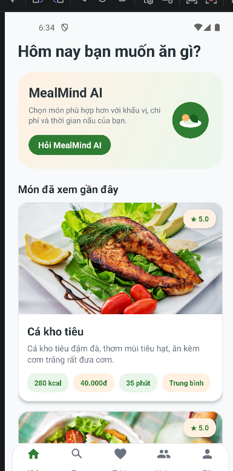

### 47. Chi tiết món có đánh giá sao

Màn hình chi tiết món hiển thị điểm đánh giá trung bình và cho phép người dùng đánh giá món ăn bằng sao.

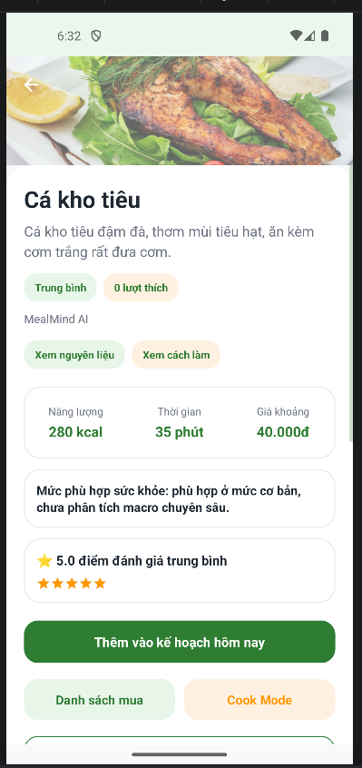

### 48. Chia sẻ công thức món ăn

Người dùng có thể chia sẻ công thức bằng Android Share Sheet thông qua các ứng dụng có sẵn trên thiết bị.

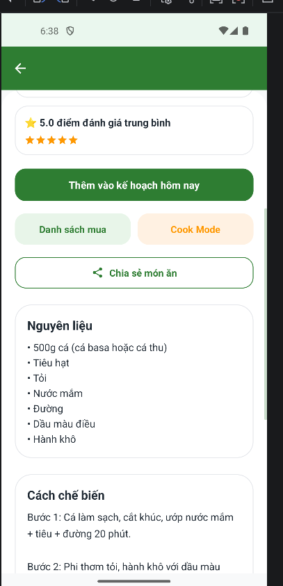

### 49. Món đã xem gần đây

Trang chủ hiển thị các món người dùng vừa xem để có thể quay lại nhanh mà không cần tìm kiếm lại.

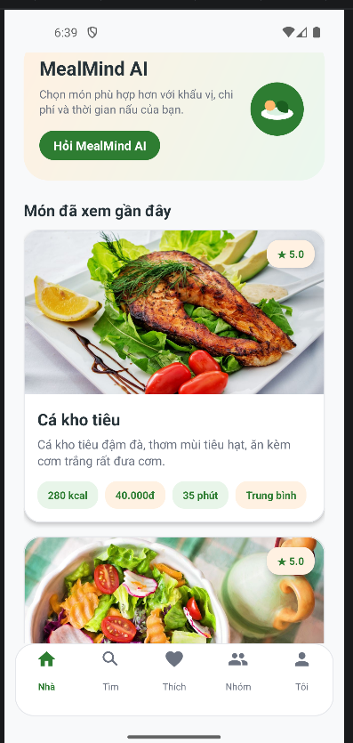

### 50. Tìm kiếm và lịch sử tìm kiếm gần đây

Màn hình tìm món hỗ trợ dùng lại nguyên liệu đã nhập, dùng nguyên liệu từ tủ lạnh và hiển thị kết quả phù hợp.

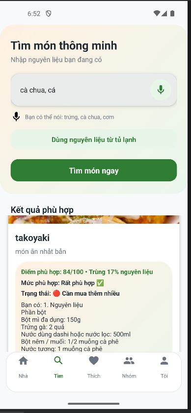

### 51. Kế hoạch bữa ăn hôm nay

Người dùng có thể thêm món vào kế hoạch hôm nay theo bữa sáng, bữa trưa hoặc bữa tối và đánh dấu món đã hoàn thành.

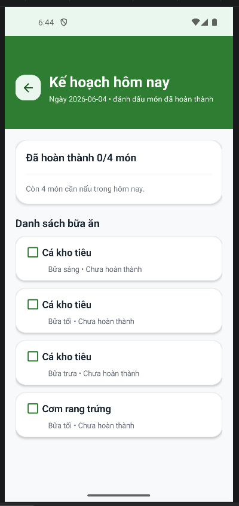

### 52. Danh sách nguyên liệu cần mua

Màn hình danh sách mua hiển thị các nguyên liệu cần chuẩn bị cho món ăn và cho phép tick checkbox khi đã chuẩn bị.

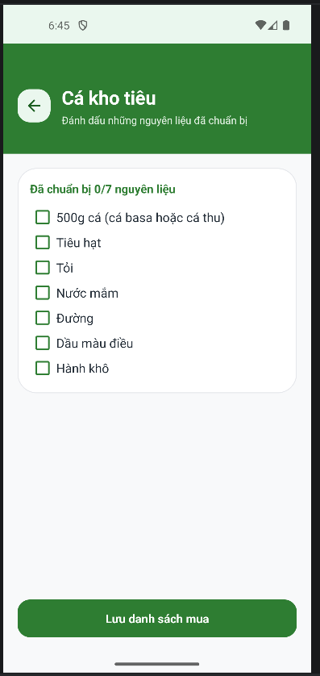

### 53. Cook Mode từng bước

Cook Mode hiển thị từng bước nấu ăn rõ ràng theo dạng Bước X/Y, giúp người dùng dễ theo dõi khi nấu.

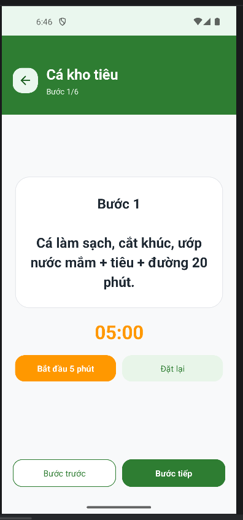

### 54. Timer trong Cook Mode

Cook Mode có timer 5 phút đơn giản để hỗ trợ người dùng trong quá trình nấu.


### 55. Công thức của tôi

Người dùng có thể xem lại các công thức mình đã gửi, theo dõi trạng thái đã duyệt hoặc bị từ chối và xem lý do từ chối.

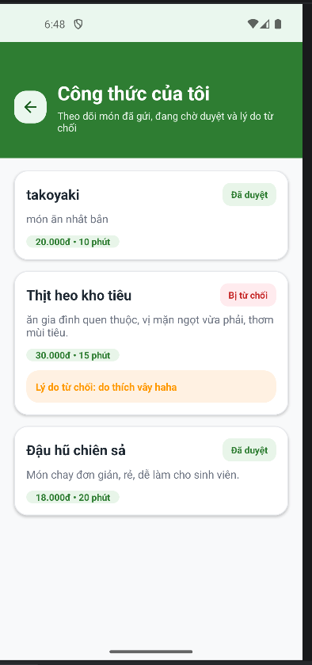

### 56. Ghi chú dinh dưỡng cơ bản

Chi tiết món hiển thị ghi chú sức khỏe cơ bản dựa trên calo và mục tiêu ăn uống của người dùng, không tự nhận là phân tích macro chuyên sâu.

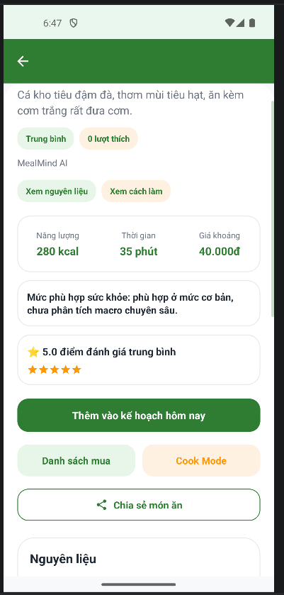

### 57. Thông báo

Màn hình thông báo hiển thị các thông báo gợi ý món hôm nay, món được duyệt hoặc bị từ chối.

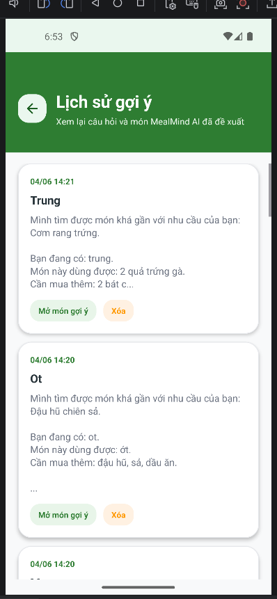

### 58. Lịch sử gợi ý AI

Người dùng có thể xem lại lịch sử câu hỏi và kết quả gợi ý từ MealMind AI.

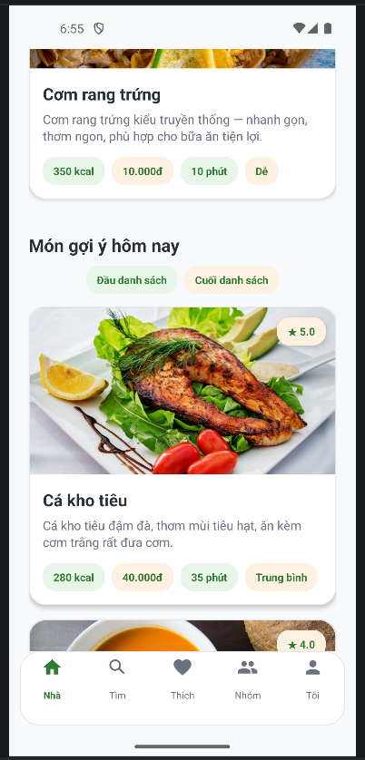

## Hướng Dẫn Chạy Project

1. Clone repository về máy.
2. Mở project bằng Android Studio.
3. Tải `google-services.json` từ Firebase Console.
4. Đặt file vào thư mục:

```text
app/google-services.json
```

5. Sync Gradle.
6. Chạy app trên emulator hoặc thiết bị Android.

## Firebase Setup

Ứng dụng sử dụng Firebase Authentication và Cloud Firestore. File `google-services.json` không nên đưa công khai nếu project chứa thông tin cấu hình riêng.

Vào Firebase Console:

```text
Project settings > General > Your apps > Android app > Download google-services.json
```

Sau đó đặt vào:

```text
app/google-services.json
```

## Kiểm Tra Build

Lệnh kiểm tra:

```bash
./gradlew :app:assembleDebug
```

Kết quả mong muốn:

```text
BUILD SUCCESSFUL
```

## Ghi Chú Demo

- Nên dùng một tài khoản user thường và một tài khoản admin riêng.
- Admin được phân quyền bằng cách sửa field `role = "admin"` trong collection `users`.
- Món người dùng gửi sẽ có `status = "pending"` và chỉ xuất hiện ở Home/Search sau khi admin duyệt.
- MealMind AI là rule-based assistant, không gọi ChatGPT/Gemini API và không chứa API key bên trong app.

## Tài Liệu Tham Khảo Bố Cục

- [63132095-AndroidProgramming](https://github.com/hungnguyen2912003/63132095-AndroidProgramming)
- [Android_Application](https://github.com/JulianNguyen05/Android_Application)
- [BTapAndroid_65CLC](https://github.com/NguyenTruong4028/BTapAndroid_65CLC)
- [64130005_MobileDevelopment](https://github.com/Danne132/64130005_MobileDevelopment)
