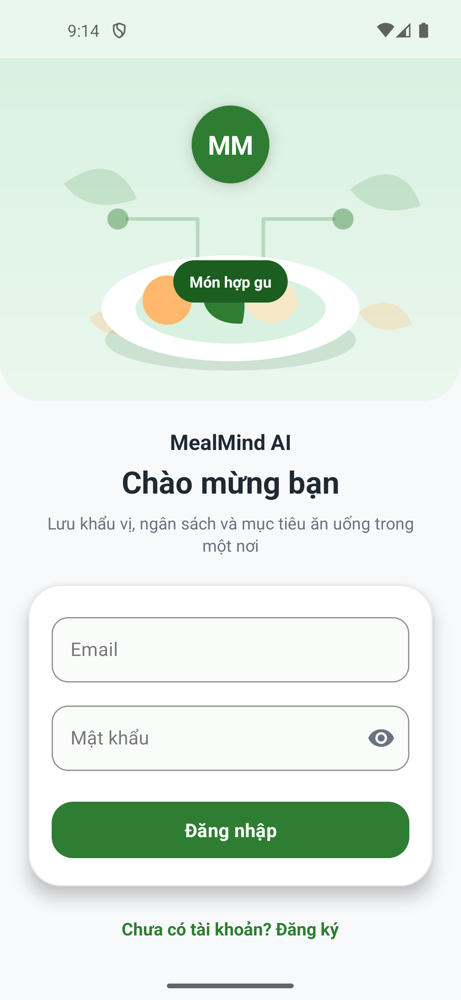
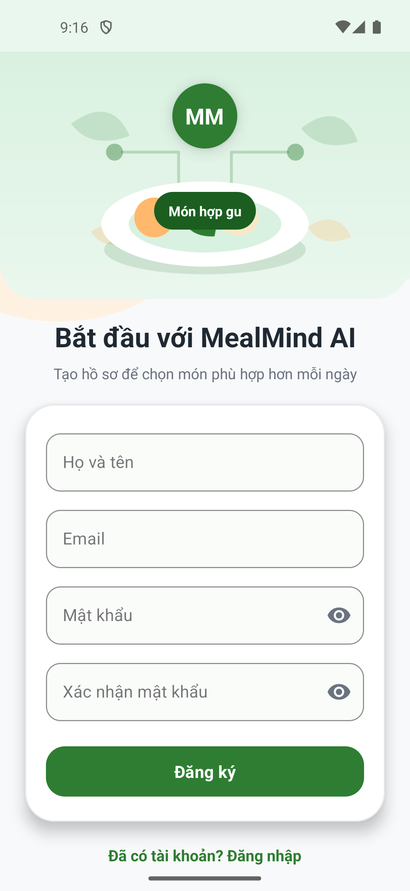

# MealMind AI - Gọi Món Ăn Thông Minh

MealMind AI là ứng dụng Android hỗ trợ người dùng lưu hồ sơ ăn uống, đăng ký/đăng nhập tài khoản và chuẩn bị nền tảng cho chức năng chọn món theo khẩu vị, ngân sách và mục tiêu sức khỏe.

## Thông Tin Project

| Mục | Giá trị |
| --- | --- |
| Tên ứng dụng | MealMind AI |
| Nền tảng | Android |
| Ngôn ngữ | Java |
| Giao diện | XML Layout |
| Package | `hung.edu.mealmindai` |
| Activity khởi chạy | `LoginActivity` |
| Database/Auth | Firebase Authentication, Cloud Firestore |
| Build tool | Gradle Kotlin DSL |

## Công Nghệ Sử Dụng

- Java
- Android XML Layout
- Firebase Authentication
- Cloud Firestore
- Material Components
- RecyclerView
- Glide

## Chức Năng Đã Thực Hiện

- Tạo cấu trúc package cho ứng dụng MealMind AI.
- Tạo các model dữ liệu: `User`, `Recipe`, `Category`, `Favorite`, `SearchHistory`, `MealPlan`.
- Tích hợp Firebase Authentication và Cloud Firestore.
- Tạo màn hình đăng nhập bằng email và mật khẩu.
- Tạo màn hình đăng ký tài khoản mới.
- Lưu thông tin người dùng mới vào Firestore collection `users`.
- Phân quyền theo field `role`: `admin` mở `AdminDashboardActivity`, `user` mở `MainActivity`.
- Thiết kế giao diện đăng nhập/đăng ký theo phong cách ứng dụng gọi món.
- Tạo màn hình Admin Dashboard placeholder.

## Cấu Trúc Thư Mục Chính

```text
app/src/main/java/hung/edu/mealmindai
|-- MainActivity.java
|-- activities
|   |-- LoginActivity.java
|   |-- RegisterActivity.java
|   |-- AdminDashboardActivity.java
|-- adapters
|-- dialogs
|-- fragments
|-- models
|   |-- User.java
|   |-- Recipe.java
|   |-- Category.java
|   |-- Favorite.java
|   |-- SearchHistory.java
|   |-- MealPlan.java
|-- repositories
|-- utils
```

## Kết Quả Giao Diện

### 1. Màn hình đăng nhập

Màn hình đầu tiên khi mở ứng dụng. Người dùng nhập email và mật khẩu để đăng nhập vào MealMind AI.



### 2. Màn hình đăng ký

Màn hình tạo tài khoản mới gồm họ tên, email, mật khẩu và xác nhận mật khẩu.



## Firebase

Ứng dụng sử dụng Firebase cho:

- Authentication: đăng ký và đăng nhập bằng email/mật khẩu.
- Cloud Firestore: lưu thông tin người dùng trong collection `users`.

Lưu ý: file `google-services.json` không đưa lên GitHub. Khi clone project về máy khác, cần tải file này từ Firebase Console và đặt vào:

```text
app/google-services.json
```

## Kiểm Tra Build

Project đã được kiểm tra với các lệnh:

```bash
./gradlew :app:assembleDebug
./gradlew :app:lintDebug
```

Kết quả: build thành công.

## Hướng Dẫn Chạy Project

1. Clone repository về máy.
2. Mở project bằng Android Studio.
3. Tải `google-services.json` từ Firebase Console.
4. Đặt file vào thư mục `app/`.
5. Sync Gradle.
6. Chạy app trên emulator hoặc thiết bị Android.

## Ghi Chú

Project đang trong giai đoạn xây dựng nên một số màn hình sau đang là placeholder. Các tính năng như danh sách món ăn, yêu thích, lịch sử tìm kiếm và lập kế hoạch bữa ăn sẽ được phát triển tiếp ở các phiên bản sau.

## Tài Liệu Tham Khảo Bố Cục

- [63132095-AndroidProgramming](https://github.com/hungnguyen2912003/63132095-AndroidProgramming)
- [Android_Application](https://github.com/JulianNguyen05/Android_Application)
- [BTapAndroid_65CLC](https://github.com/NguyenTruong4028/BTapAndroid_65CLC)
- [64130005_MobileDevelopment](https://github.com/Danne132/64130005_MobileDevelopment)
